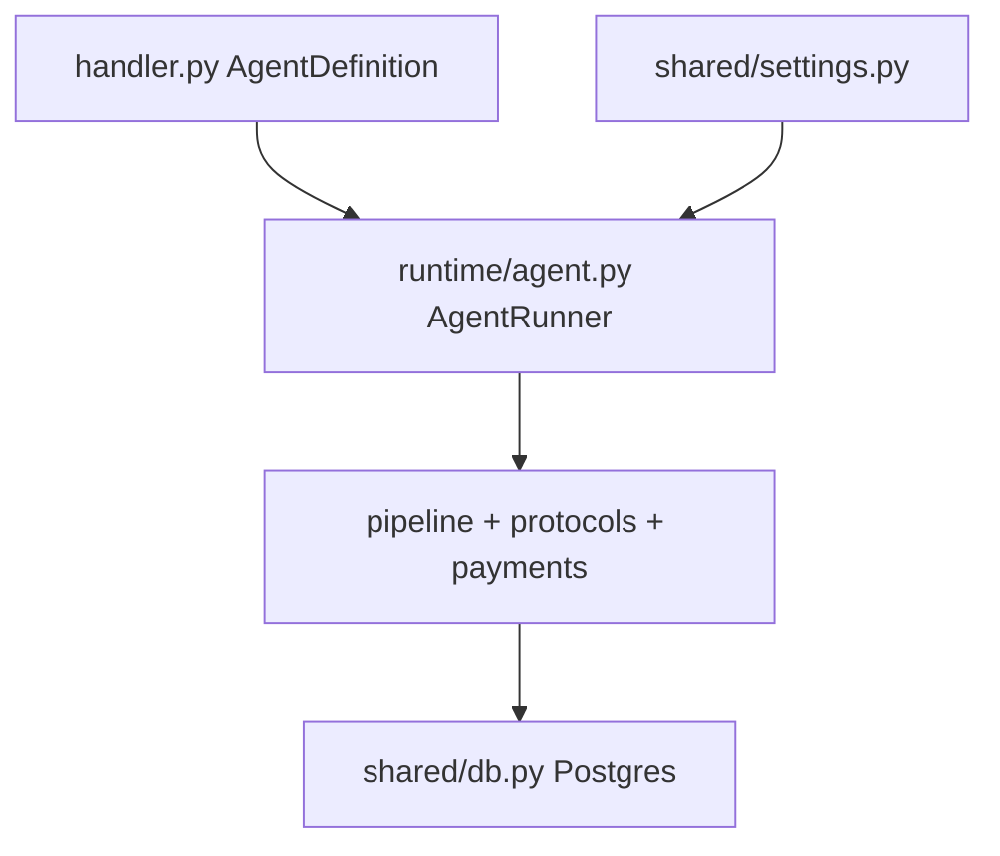

# Architecture

How a generated agent project is structured and how messages flow through the runtime.

---

## High-level flow



---

## Configuration loading

```
agent.yml  ──┐
             ├──► shared/settings.py ──► AgentRunner, protocols, payments
.env       ──┘
```

`shared/settings.py` validates and merges both sources. The runtime never reads YAML or dotenv directly.

---

## Message path

1. **Inbound** — uAgents chat/payment protocol receives a message.
2. **Coordination** — `shared/db.py` assigns work via Postgres (session locks, idempotency, multipod queue).
3. **Pipeline** — `runtime/pipeline.py` builds a `HandlerRequest` (`ChatInput` or `PaymentUpdate`).
4. **Handler** — your `on_message` in `handler.py` returns `TextReply` or `PaymentRequest`.
5. **Outbound** — framework maps the response back to protocol messages.

---

## Runtime modules

| Module | Role |
|--------|------|
| `runtime/agent.py` | `AgentRunner` — wires uAgents agent, loads `AgentDefinition` |
| `runtime/main.py` | CLI entry (`uv run agent`) |
| `runtime/pipeline.py` | Message dispatch to handler |
| `runtime/protocols/` | Chat and payment protocol handlers, rate limits, ACL |
| `runtime/payments/` | FET, Stripe, Skyfire integrations |
| `runtime/lifecycle/` | Coordinator, heartbeat, worker assignment |
| `runtime/registration.py` | Smart Agentverse registration |
| `shared/db.py` | Postgres work queue and session state |
| `shared/types.py` | `AgentDefinition`, `HandlerRequest`, `HandlerResponse` |

---

## Multipod coordination

Multiple agent pods can run against one Postgres database. The coordinator:

- Assigns messages to workers with TTL-based leases
- Holds session locks so one pod handles a conversation at a time
- Reclaims stale assignments when a pod dies

Tune TTLs under `runtime.coordinator` in `agent.yml`.

---

## Payments

When the payment protocol is enabled, `runtime/payments/` handles provider-specific flows. Your handler can return `PaymentRequest` to ask for payment before continuing.

Enable providers in `agent.yml` → `protocols.payment.methods` and set keys in `.env`.

---

## What you implement

| You write | Framework handles |
|-----------|-------------------|
| `handler.py` (`AgentDefinition`) | uAgents lifecycle |
| `agent.yml`, `.env` | Protocol wiring, rate limits, ACL |
| `AGENTVERSE.md` | Postgres coordination, registration |

See [Handler Guide](handler.md) and [Generated Structure](structure.md).
